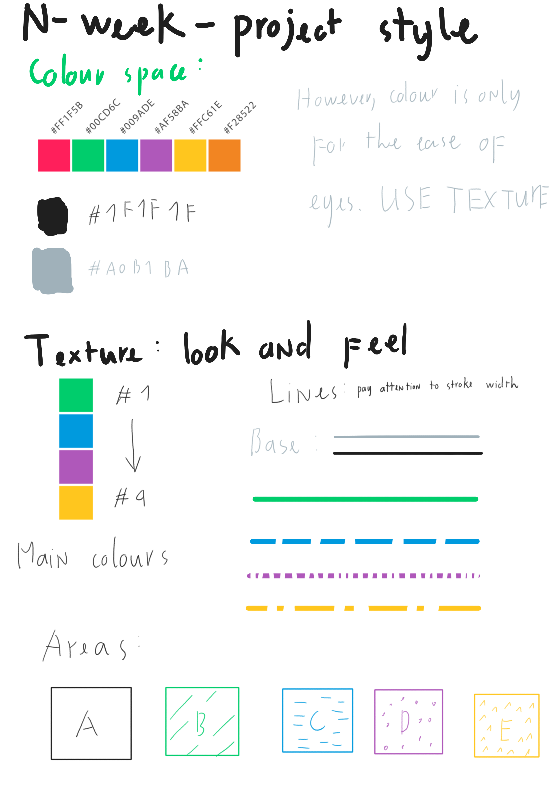

# n-week-project
*Currently migrating, please wait for more information...*

## Style guide


## Regex rules for migration
`\n\n` to
```html
</p>

<p>
```

`<p><h(.)` to `<h$1`

`</h(.)>\n` to
```html
</h$1>
<p>
```

`\\textbf\{` to `<b>`

`\\textit\{` to `<i>`

Find `\ref`, `\footnote`

Remove `style="width: .*%;" ` (space at the end)

`figure style="width: .*%; text-align: center;"`to `figure`

## Note of what to write here
- `.GITIGNORE` to have header background unique to each publication at `/header.*`